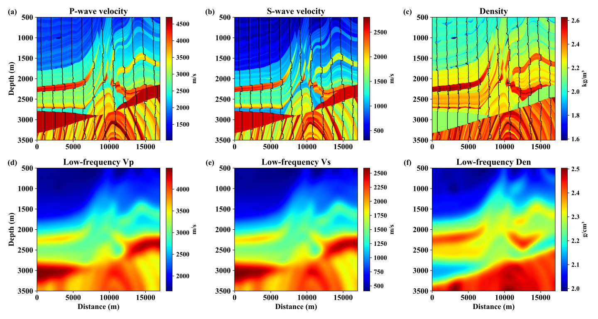
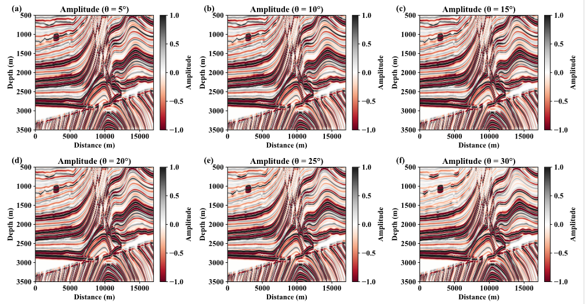
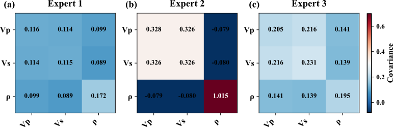

# Variational Bayesian Mixture of Experts for AVA Inversion

This repository provides **two implementations** of the method described in the paper:  
*"Geology‑Guided Variational Bayesian Mixture of Experts for AVA Inversion"*.

| Version | Directory | Description | Key Features | GPU Memory |
|---------|-----------|-------------|--------------|-------------|
| **1D (simplified)** | `VBMILE1d/` | Fast prototyping, trace‑independent | Diagonal Gaussian, 1D convolutions | < 2 GB |
| **2D (full)** | `VBMILE2d/` | Complete paper implementation | Full‑covariance GMM, 2D spatial priors, FiLM modulation | **> 8 GB** |

Use the **1D version** for quick experiments, debugging, and resource‑limited environments.  
Use the **2D version** to reproduce the results reported in the paper (requires a GPU with >8 GB memory).

The synthetic seismic data are generated using the **Aki‑Richards approximation** for six angles: **5°, 10°, 15°, 20°, 25°, 30°**.
---

## Project Overview

| Component | Description |
|-----------|-------------|
| **Elastic parameters** | Vp, Vs, Density (three‑parameter inversion) |
| **Model test** | Marmousi2 (2D section, 1200×1360 after subsampling) |
| **Forward modelling** | Aki‑Richards equation → angle‑domain seismic gathers |
| **Prior** | GMM trained on well logs (3 components), providing mean vectors and covariance matrices. For 1D simplification we use diagonal variances; for 2D we use full covariances. |
| **Visualisation** | Predicted sections, uncertainty envelopes, expert partition maps, covariance structures. |

  
*True elastic parameters from Marmousi2 (Vp, Vs, Density)*

  
*Example of synthetic seismic data for six angles (5°–30°)*

  
*Learned prior covariances for three experts (3×3 matrices)*

## Requirements

- Python 3.9+
- PyTorch 1.10+ (CUDA recommended for 2D version)
- NumPy, SciPy, Matplotlib, scikit‑image, scikit‑learn

```bash
pip install -r requirements.txt
```

## Data Preparation

Place the following files in `./data/` (paths can be changed in `config.py`):

| File                          | Description                                 |
|-------------------------------|---------------------------------------------|
| `Vp.npy`, `Vs.npy`, `Den.npy` | True elastic models (2D sections)           |
| `elastic_impedance_results.mat` | Synthetic angle gathers (6 angles)        |
| `spatial_prior3.pt`           | Spatial prior maps (K×H×W)                  |


## License
MIT License – see `LICENSE`.
